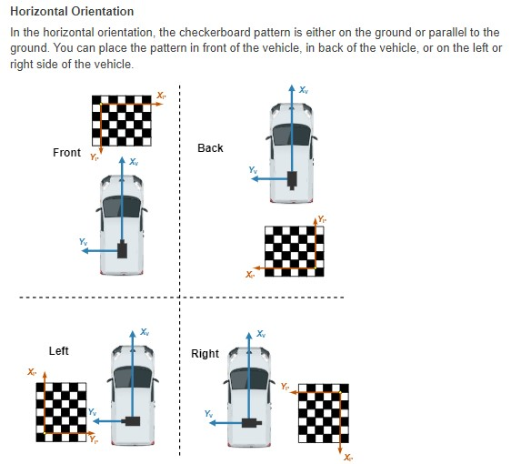
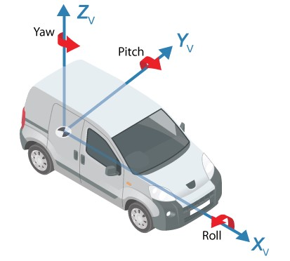

# 建图C++程序

2023.2.6 崔星星首次记录

>用于复现此项目分支[matlab_branch](http://autogit.long-horn.com:3000/Algorithm_public/SLAM_VS_PROJECT/src/matlab_branch)的C++工程代码,输入输出结果可以保证达到一致的运行结果。根据年前部分工作，做简要的头文件描述接口用法，后续会存在变动可能，更新会在此库进行。

为便于同事直接移植使用，本C++程序只依赖OpenCV，下面只有建图过程的代码，通过`CMake`可编译适用于各个平台的项目文件。关于闭环检测、因子图优化的C++代码我后续会集成进来。

## 建图主接口API

`BuildHDMap`类为主类，接口较简单，一个默认构造函数`BuildHDMap()`和一个`Run()`函数。对应项目中头文件`BuildHDMap.hpp`。

```C++
class BuildHDMap {
   private:
    struct1_T m_birdsEye360CaliParameter;  // 对应constructWorldMap主函数输入birdsEye360
    struct6_T m_outputStruct;              // 对应constructWorldMap主函数输出outputStruct

   public:
    BuildHDMap();
    struct6_T Run(struct0_T &inputArgsPose);
    ~BuildHDMap();
};
```

在使用该类的时候，只需一次初始化一个实例对象，然后在每次获取4副环视图像的循环中不断调用`Run()`函数返回建图结果。大致使用方法可以参考[`main.cpp`](./main.cpp)用法，里面其他关于涉及到文件系统`filesystem`的可以不管，根据自己嗜好选用即可。

---
构造函数`BuildHDMap()`内部已经默认对**4个环视相机**的每个相机参数进行了初始化，如果遇到不同的配置，则需要更改，以下参数是适用于**2022年上半年曾总UE仿真的数据集**。里面涉及到坐标系统如下图所示，距离单位：米；角度单位：度。





结构体`m_birdsEye360CaliParameter`包含2个域，分别为`birdsEye`、`tforms`,参数解释如下层次结构：

- `birdsEye`的索引0,1,2,3分别代表`front`,`left`,`back`,`right`方向的相机的**内外参**结构体。
  - `OutputView`的索引0,1,2,3分别代表`xmin`,`xmax`,`ymin`,`ymax`方向的相机的**可视距离范围**结构体。
  - `ImageSize`的索引0,1分别代表单应变换到以`front`为基准的**图像高和宽**结构体。
  - `Sensor`代表相机**外参**的结构体。
    - `Height`相机挂载高度。
    - `Pitch` 相机俯仰角。
    - `Yaw` 相机航向角。
    - `Roll` 相机翻滚角。
    - `SensorLocation`相机挂载以`front`为基准的**水平位置坐标**结构体，索引0,1分别代表`x`,`y`坐标。
- `tforms`的索引0,1,2,3分别代表`front`,`left`,`back`,`right`方向的相机到front的**单应变换矩阵**结构体。
  - `A`代表3×3的单应矩阵，C++中以`double A[9]`形式保持在`tforms`结构体中。

```C++
BuildHDMap::BuildHDMap() {
    //Initialize the application.You do not need to do this more than one time.
    constructWorldMap_initialize();
    emxInit_struct6_T(&m_outputStruct);

    // front camera
    m_birdsEye360CaliParameter.birdsEye[0].OutputView[0] = -1; //xmin
    m_birdsEye360CaliParameter.birdsEye[0].OutputView[1] = 10;//xmax
    m_birdsEye360CaliParameter.birdsEye[0].OutputView[2] = -10;//ymin
    m_birdsEye360CaliParameter.birdsEye[0].OutputView[3] = 10;//ymax
    m_birdsEye360CaliParameter.birdsEye[0].ImageSize[0] = 352;// image height
    m_birdsEye360CaliParameter.birdsEye[0].ImageSize[1] = 640; // image width

    m_birdsEye360CaliParameter.birdsEye[0].Sensor.Height = 0.9856; // 相机挂载离地面高度
    m_birdsEye360CaliParameter.birdsEye[0].Sensor.Pitch = 19.9030; //相机挂载Pitch角度
    m_birdsEye360CaliParameter.birdsEye[0].Sensor.Yaw = -0.0038;//相机挂载Yaw角度
    m_birdsEye360CaliParameter.birdsEye[0].Sensor.Roll = 0.0;//相机挂载Roll角度
    m_birdsEye360CaliParameter.birdsEye[0].Sensor.SensorLocation[0] = 0.0;//相机挂载的x坐标
    m_birdsEye360CaliParameter.birdsEye[0].Sensor.SensorLocation[1] = 0.0;//相机挂载的y坐标
    std::strcpy(m_birdsEye360CaliParameter.birdsEye[0].Sensor.WorldUnits, "meters");

    // left camera
    m_birdsEye360CaliParameter.birdsEye[1].OutputView[0] = -10;
    m_birdsEye360CaliParameter.birdsEye[1].OutputView[1] = 10;
    m_birdsEye360CaliParameter.birdsEye[1].OutputView[2] = -1;
    m_birdsEye360CaliParameter.birdsEye[1].OutputView[3] = 10;
    m_birdsEye360CaliParameter.birdsEye[1].ImageSize[0] = 1163;
    m_birdsEye360CaliParameter.birdsEye[1].ImageSize[1] = 640;

    m_birdsEye360CaliParameter.birdsEye[1].Sensor.Height = 1.24;
    m_birdsEye360CaliParameter.birdsEye[1].Sensor.Pitch = 44.6173;
    m_birdsEye360CaliParameter.birdsEye[1].Sensor.Yaw = 89.8207;
    m_birdsEye360CaliParameter.birdsEye[1].Sensor.Roll = 0.1250;
    m_birdsEye360CaliParameter.birdsEye[1].Sensor.SensorLocation[0] = 0.0;
    m_birdsEye360CaliParameter.birdsEye[1].Sensor.SensorLocation[1] = 0.0;
    std::strcpy(m_birdsEye360CaliParameter.birdsEye[1].Sensor.WorldUnits, "meters");

    // back camera
    m_birdsEye360CaliParameter.birdsEye[2].OutputView[0] = -10;
    m_birdsEye360CaliParameter.birdsEye[2].OutputView[1] = 1;
    m_birdsEye360CaliParameter.birdsEye[2].OutputView[2] = -10;
    m_birdsEye360CaliParameter.birdsEye[2].OutputView[3] = 10;
    m_birdsEye360CaliParameter.birdsEye[2].ImageSize[0] = 352;
    m_birdsEye360CaliParameter.birdsEye[2].ImageSize[1] = 640;

    m_birdsEye360CaliParameter.birdsEye[2].Sensor.Height = 1.0154;
    m_birdsEye360CaliParameter.birdsEye[2].Sensor.Pitch = 19.8682;
    m_birdsEye360CaliParameter.birdsEye[2].Sensor.Yaw = -179.9023;
    m_birdsEye360CaliParameter.birdsEye[2].Sensor.Roll = -0.0625;
    m_birdsEye360CaliParameter.birdsEye[2].Sensor.SensorLocation[0] = 0.0;
    m_birdsEye360CaliParameter.birdsEye[2].Sensor.SensorLocation[1] = 0.0;
    std::strcpy(m_birdsEye360CaliParameter.birdsEye[2].Sensor.WorldUnits, "meters");

    // right camera
    m_birdsEye360CaliParameter.birdsEye[3].OutputView[0] = -10;
    m_birdsEye360CaliParameter.birdsEye[3].OutputView[1] = 10;
    m_birdsEye360CaliParameter.birdsEye[3].OutputView[2] = -10;
    m_birdsEye360CaliParameter.birdsEye[3].OutputView[3] = 1;
    m_birdsEye360CaliParameter.birdsEye[3].ImageSize[0] = 1163;
    m_birdsEye360CaliParameter.birdsEye[3].ImageSize[1] = 640;

    m_birdsEye360CaliParameter.birdsEye[3].Sensor.Height = 1.2485;
    m_birdsEye360CaliParameter.birdsEye[3].Sensor.Pitch = 45.2806;
    m_birdsEye360CaliParameter.birdsEye[3].Sensor.Yaw = -90.1980;
    m_birdsEye360CaliParameter.birdsEye[3].Sensor.Roll = 0.1250;
    m_birdsEye360CaliParameter.birdsEye[3].Sensor.SensorLocation[0] = 0.0;
    m_birdsEye360CaliParameter.birdsEye[3].Sensor.SensorLocation[1] = 0.0;
    std::strcpy(m_birdsEye360CaliParameter.birdsEye[3].Sensor.WorldUnits, "meters");

    // 内参都一样
    for (size_t i = 0; i < 4; i++) {
        m_birdsEye360CaliParameter.birdsEye[i].Sensor.Intrinsics.FocalLength[0] = 317.8183;
        m_birdsEye360CaliParameter.birdsEye[i].Sensor.Intrinsics.FocalLength[1] = 317.8183;
        m_birdsEye360CaliParameter.birdsEye[i].Sensor.Intrinsics.PrincipalPoint[0] = 2866.778010428930429;
        m_birdsEye360CaliParameter.birdsEye[i].Sensor.Intrinsics.PrincipalPoint[1] = 529.816904864335;
        m_birdsEye360CaliParameter.birdsEye[i].Sensor.Intrinsics.ImageSize[0] = 1063;
        m_birdsEye360CaliParameter.birdsEye[i].Sensor.Intrinsics.ImageSize[1] = 5796;
        m_birdsEye360CaliParameter.birdsEye[i].Sensor.Intrinsics.RadialDistortion[0] = 0,
        m_birdsEye360CaliParameter.birdsEye[i].Sensor.Intrinsics.RadialDistortion[1] = 0;
        m_birdsEye360CaliParameter.birdsEye[i].Sensor.Intrinsics.TangentialDistortion[0] = 0;
        m_birdsEye360CaliParameter.birdsEye[i].Sensor.Intrinsics.TangentialDistortion[1] = 0;
        m_birdsEye360CaliParameter.birdsEye[i].Sensor.Intrinsics.Skew = 0;
    }

    // 四副环视图到基准第一个到转换
    auto init0 = std::initializer_list<double>({1, 0, 0, 0, 1, 0, 0, 0, 1});
    std::copy(init0.begin(), init0.end(), m_birdsEye360CaliParameter.tforms[0].A);
    auto init1 = std::initializer_list<double>({0.539859, -0.0114774, 0, 0.00148547, 0.54053, 0, -25.6848, 58.0006, 1});  // join(string((birdsEye360.tforms{3}.A(:))),',')
    std::copy(init1.begin(), init1.end(), m_birdsEye360CaliParameter.tforms[1].A);
    auto init2 = std::initializer_list<double>({0.9945768, -0.03405895, 0, -0.003624775, 0.9873774, 0, 0.5879876, 430.9479, 1});
    std::copy(init2.begin(), init2.end(), m_birdsEye360CaliParameter.tforms[2].A);
    auto init3 = std::initializer_list<double>({0.5489015, -0.01142391, 0, 0.003611683, 0.5398036, 0, 317.7876, 53.31789, 1});
    std::copy(init3.begin(), init3.end(), m_birdsEye360CaliParameter.tforms[3].A);
}

struct6_T BuildHDMap::Run(struct0_T &inputArgsPose) {
    struct6_T outputStruct = m_outputStruct;
    constructWorldMap(&inputArgsPose, &m_birdsEye360CaliParameter, &outputStruct);
    return outputStruct;
}

BuildHDMap::~BuildHDMap() {
    // 释放
    emxDestroy_struct6_T(m_outputStruct);
    constructWorldMap_terminate();
}
```

## 数据结构说明

---
由于上述主类中的数据类型是自动C++代码工具生成的，同事较难以理解含义，我做如下说明。

- 必须引用的头文件(`contructSrc/`文件夹)：

```C++
#include "common.hpp"
#include "BuildHDMap.hpp" // 主类接口
#include "opencv2/opencv.hpp" // 依赖OpenCV
#include "constructWorldMap.h" // 算法实现的头文件
#include "constructWorldMap_emxAPI.h"// 创建、销毁数组，此类型的数组与matlab内置数组属性一致
#include "constructWorldMap_types.h" // 自定义的一些数组类型
#include "rt_nonfinite.h" //用于处理超出边界，nan等数据溢出的
#include <string.h>
```

- 可选的头文件(`c_cpp_utils/`文件夹)：

```C++
#include "c_cpp_utils/path.h" // 用于路径操作的
#include "c_cpp_utils/spdlog/spdlog.h"// 用于log操作的
#include <gperftools/profiler.h>// 用于测试性能操作的
```

---

用于循环中的主函数`struct6_T BuildHDMap::Run(struct0_T &inputArgsPose)`参数：

- 输入参数`struct0_T`类型定义如下：

```C++
# ifndef typedef_struct0_T

# define typedef_struct0_T

typedef struct {
  cell_wrap_0 undistortImages[4];
  double currFrontBasePose[3];
  bool isuseGT;
} struct0_T;

# endif /*typedef_struct0_T*/
```

该结构体包含3个域成员，其中，`undistortImages`存储为4副无畸变环视图；`currFrontBasePose`存储当前位姿[$x$,$y$,$\theta$]；`isuseGT`是否使用接收第三方里程计。

- 返回参数类型`struct6_T`类型定义如下：

```C++
#ifndef typedef_struct6_T
#define typedef_struct6_T
typedef struct {
  struct7_T HDmap;
  emxArray_real_T *vehicleTraj;
} struct6_T;
#endif /* typedef_struct6_T */
```

该结构体包含2个域成员，其中，`HDmap`为输出的HD map；`vehicleTraj`为车辆行驶的轨迹坐标。

关于上面输入输出参数结构体类型的二级或更多级的域成员申明可以参考[`constructWorldMap_types.h`](./constructSrc/constructWorldMap_types.h)头文件申明。
