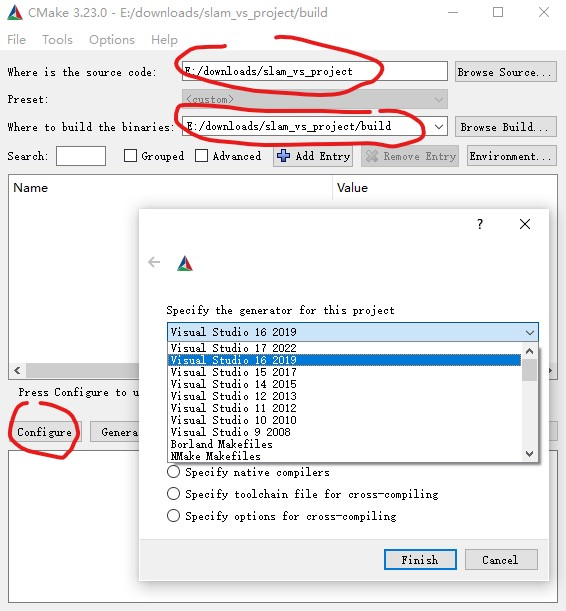
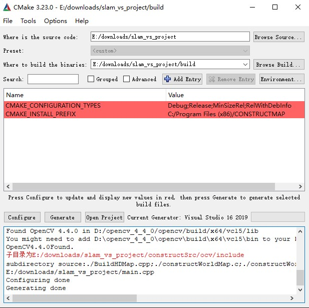
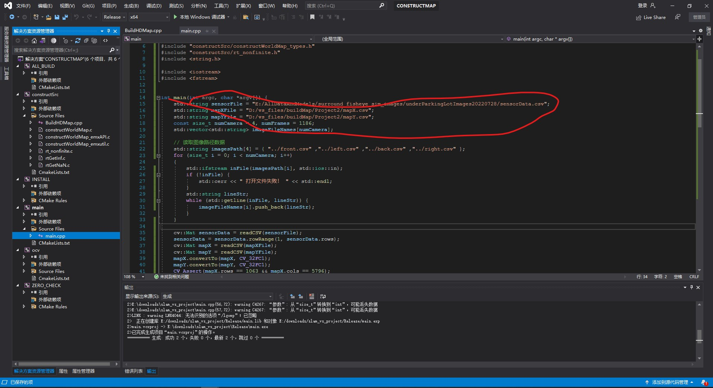
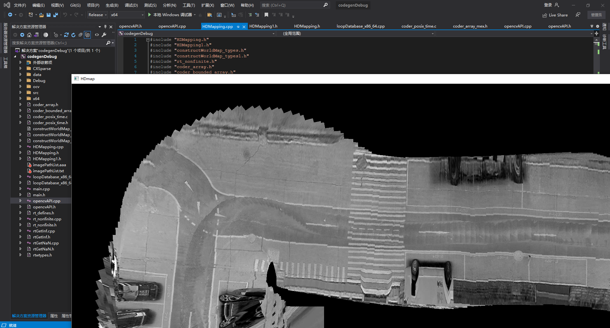

# Visual-Based-Odometry-Estimation1-cpp

[](https://raw.githubusercontent.com/cuixing158/OpticalFlow-Visualization/refs/heads/main/README_media/sponsors.jpg)

Used to reproduce the project [matlab_repo](https://github.com/cuixing158/Visual-Based-Odometry-Estimation2) into C++ code. The input and output results can ensure consistent execution results. Supported on platforms such as TI/Windows/Linux.

用于复现仓库[matlab_repo](https://github.com/cuixing158/Visual-Based-Odometry-Estimation2)的C++工程代码,输入输出结果可以保证达到一致的运行结果。支持在Ti/win/linux等平台运行。

## Requirements

- OpenCV 4.x

- C++ Compiler (e.g., GCC, Clang, or MSVC)

There are no specific platform or compiler requirements. If you are using OpenCV 3.x, you need to modify the source code accordingly (for example, change cv::ORB::ScoreType, which is an enumeration type in 4.x, to an int type).

无特定平台和编译器要求，如果您使用`OpenCV3.x`,需要适当修改源码(如`cv::ORB::ScoreType`为4.x的枚举类型，改为`int`类型即可)。

## API

C API:

``` C
#ifdef __cplusplus
extern "C" {
#endif

extern struct HDMappingWrapper* InitInstance();

extern void buildMap(HDMappingWrapper* pOrbSlamHandle, cv::Mat& bevImage);

extern void UnInitHDMapping(struct HDMappingWrapper* pOrbSlam3Handle);

#ifdef __cplusplus
};
#endif
```

---
C++ API:

The `HDMapping` class is the main class with a simple interface, consisting of a default constructor `HDMapping()` and a function `b_constructWorldMap()`. This corresponds to the header file `HDMapping.h` in the project.

`HDMapping`类为主类，接口较简单，一个默认构造函数`HDMapping()`和一个`b_constructWorldMap()`函数。对应项目中头文件`HDMapping.h`。

```C++

#ifndef HDMAPPING_H
#define HDMAPPING_H

#include "constructWorldMap_types.h"
#include "constructWorldMap_types1.h"
#include "rtwtypes.h"
#include "omp.h"
#include <cstddef>
#include <cstdlib>

namespace buildMapping {
class HDMapping {
public:
  HDMapping();
  ~HDMapping();
  void b_constructWorldMap(const struct0_T *inputArgs,
                           struct1_T *inputOutputStruct);// 仅调用此接口即可
  constructWorldMapStackData *getStackData();

private:
  constructWorldMapPersistentData pd_;
  constructWorldMapStackData SD_;
};

} // namespace buildMapping

namespace buildMapping {
extern omp_nest_lock_t constructWorldMap_nestLockGlobal;
}

#endif
```

使用上面建图类示例伪代码：

```C++
while 循环不断取全景拼接图
    cv::Mat srcImg = cv::imread(imagePath, cv::IMREAD_GRAYSCALE);
    assert(srcImg.rows == 480 && srcImg.cols == 640 && srcImg.channels() == 1);
    convertCVToMatrix(srcImg, srcImg.rows, srcImg.cols, srcImg.channels(), r.undistortImage);

    // 调用建图主函数
    instancePtr->b_constructWorldMap(&r, &inputOutputStruct);
    cv::Mat HDMapImg;
    convertToMat(inputOutputStruct.HDmap.bigImg.data(), inputOutputStruct.HDmap.bigImg.size(0), inputOutputStruct.HDmap.bigImg.size(1), 1, HDMapImg);
    cv::imshow("HDmap", HDMapImg);// 展现实时图
```

## 数据结构说明

由于上述主类中的数据类型是自动C++代码工具生成的，同事较难以理解含义，只需对入口函数类型掌握即可。

**输入数据必须确保正确！！！**

- 输入参数`struct0_T`类型定义如下：

```C++
namespace buildMapping {
struct struct0_T {
  unsigned char undistortImage[307200]; // 480*640=307200
  double currFrontBasePose[3]; // [x,y,theta]，可不提供输入，接口预留后期使用
  bool isuseGT; // 可不提供输入，接口预留后期使用
};
```

该结构体包含3个域成员，其中，`undistortImage`存储为1副全景$480\times640$（$H \times W$）大小单通道拼接图(鸟瞰图，确保已经是无畸变)；`currFrontBasePose`存储当前位姿[$x$,$y$,$\theta$]；`isuseGT`是否使用接收第三方里程计。

- 返回参数类型`struct1_T`类型定义如下：

```C++
struct struct1_T {
  struct2_T HDmap; // 输出建图图像和参考坐标系
  ::coder::array<double, 2U> vehiclePoses; // 累计输出车辆位姿数据[x,y,theta]
  double cumDist; // 输出累计行驶距离，单位：米
  bool isOver; // 是否建图完毕
};
```

该结构体包含4个域成员，其中，`HDmap`为输出的HD map;`vehiclePoses`为车辆行驶的轨迹坐标，其为$m\times3$大小矩阵，$m$为累计当前帧数，每行形如$[x,y,\theta]$，$x$,$y$ 为以第一幅图像坐标基准的像素坐标，$\theta$为车辆姿态角度，单位弧度;`cumDist`为累计行驶距离；`isOver`标志是否姿态图已优化完毕。

```C++
struct struct2_T {
  ::coder::array<unsigned char, 2U> bigImg; // 建图像素图像
  struct3_T ref; // 参考坐标系，始终是以第一副图像像素坐标系为基准
};
```

输出参数`HDmap`子类型仍然为结构体类型，也包含2个域成员，其中`bigImg`为对应的像素大图像；`ref`为对应此大图像的参考空间坐标系。

## Notes

- demo中示例数据存放在:<https://github.com/cuixing158/Visual-Based-Odometry-Estimation-cpp/releases/tag/v1.0.0>

- 对于闭环过程中词袋特征文件、后期姿态图优化的全局图像拼接使用的数据文件需要**事先默认保存到当前工程根目录**，即这2个文件分别位于：`./data/preSavedData/database.yml.gz`、`./data/preSavedData/imagePathList.txt`

## 如何配置使用

适合各类平台和编译器支持，以下配置仅供参考。

- linux上:

```bash
git clone https://github.com/cuixing158/Visual-Based-Odometry-Estimation1-cpp.git
cd Visual-Based-Odometry-Estimation1
mkdir build
cd build
cmake .. 
make install
```

- windows上：

先从`https://github.com/cuixing158/Visual-Based-Odometry-Estimation1-cpp.git`下载好对应`main`分支源码压缩包并解压。

修改根目录中的`CmakeLists.txt`中的第12行指出自己`OpenCV`安装路径，比如我windows上安装路径为`set(OpenCV_DIR "D:/opencv_4_4_0/opencv/build")`或者系统环境变量指定此`OpenCV_DIR`定义。

接下来使用Cmake-GUI构建如下图：

<table>
    <tr>
        <td ><center>图1  Cmake configure </center></td>
        <td ><center>图2 Cmake configure</center></td>
    </tr>
</table>

然后选择好自己的路径和编译器版本，点Configure和Generate就可以生成对应VC的项目工程了。我用的是VS2019,打开生成的sln文件，如下图进行编译并运行。



---

对全景图跑通结果截图如下：


